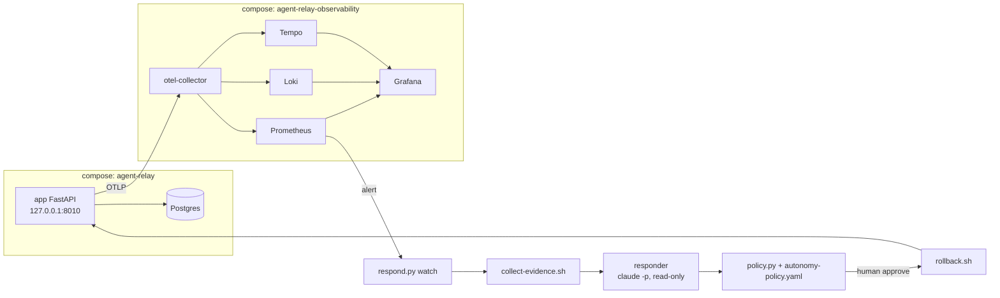

# Agent Relay

Agent Relay is an HTTP task relay that lets software agents hand work to each other. This fork adds an incident loop that catches a bad release and rolls it back in minutes without giving the AI responder write access: a read-only Claude responder diagnoses and proposes, a code-enforced policy decides what may run, and a human approves.

**Status:** built for [AI Dev Tools Zoomcamp](https://github.com/DataTalksClub/ai-dev-tools-zoomcamp) 2026, Modules 3 and 4, as a fork of [alexeygrigorev/agent-relay](https://github.com/alexeygrigorev/agent-relay). The full write-up is [docs/operations-and-security-report.md](docs/operations-and-security-report.md). It was built against the draft of the Module 4 homework; the graded homework 4 is in a separate Order Tracker repo.

## Problem

Agents register with the relay, send tasks to each other's inboxes, claim them and post results. When a release breaks the claim or complete path, requests fail, leases expire, tasks are retried until they run out of attempts, and work piles up in inboxes. In the primary incident below, one bad release left 25 tasks permanently `failed` and 1529 failed complete requests in the logs within 16 minutes. Detecting that quickly needs per-route signals, and responding quickly tempts you to let a coding agent act. This repo shows one way to get the speed without handing the agent write access: the model reads evidence and proposes; code decides what may run; a human approves.

## Demo


*5xx ratio by route, 2026-09-26, times in EAT (UTC+3). Only the complete route fails, at 30 to 45%, until the rollback at 21:44. The straight ramp before 21:28 is a line drawn across a gap with no traffic; the dashboard no longer draws it (commit `71dac87`), and the screenshot predates that change.*


*The dashboard while the alert fired: running version V_BAD, alert FIRING, queue depth 1.44K and the oldest queued task 5.16 min old.*

More screenshots (request rate, the Loki warnings panel, the dashboard after the fix) are in [report §3.6](docs/operations-and-security-report.md#36-screenshots).

**The primary incident, step by step** (UTC, from the incident's `timeline.jsonl` and [report §3.2](docs/operations-and-security-report.md#32-timeline)):

| Time | Step | What happened |
|---|---|---|
| 18:28:19 | Deploy | Release `20260926-182749-105fb53` (V_BAD) ships an openly labelled fault switch that fails 35% of complete requests |
| 18:30:37 | Alert | The watcher sees `RelayClaimCompleteErrorRatioHigh` firing on the complete route at 35.5% and opens the incident, **2 min 18 s after deploy** |
| 18:30:43 | Evidence | A fixed, read-only evidence packet (metrics, logs, traces, deploy history, diff) is collected and secret-scanned in 5.5 s |
| 18:31:28 | Proposal | The responder names commit `105fb53`, confidence 0.9, and proposes rollback to `20260926-181002-829513a` (44.8 s, $0.19) |
| 18:31:29 | Policy | `require_approval` at L1; all 6 rollback preconditions pass |
| 18:44:14 | Approval | Human approves after a 12 min 45 s wait; every precondition is re-checked on fresh facts |
| 18:44:22 | Rollback | `rollback.sh` switches to the previous image with no build, **8 s after approval** |
| 18:45:25 | Verified | `verify-recovery.sh` passes 5 of 5 checks, **1 min 11 s after approval** |
| 19:01:40 | Fix forward | The revert (`0a7a1fb`) ships as V_FIXED and passes the same 5 checks |

## Does it work?

### Tests

`uv run pytest -q` runs 93 tests; the collection paths are fixed in `pyproject.toml`, so generated folders are never collected.

| Suite | Tests | Covers |
|---|---|---|
| `test_agent_relay.py` | 6 | protocol, idempotency, auth boundaries, concurrent claims, lease expiry and recovery, full task exchange, enrollment check |
| `test_observability.py` | 3 | `/version`, which routes are traced, no secret in spans, logs or metrics |
| `incident-response/tests/test_policy.py` | 44 | autonomy policy: approvals, wrong target version, missing image at confidence 0.99, shell commands as proposals, schema-invalid output, second action, low confidence, the approval-time re-check, malformed policy files |
| `incident-response/tests/test_redact_secrets.py` | 27 | evidence redaction and the secret-scan backstop |
| `incident-response/tests/test_respond.py` | 11 | responder environment allowlist and locked-down command flags, response extraction, runbook runner refusing anything but allowed scripts and arguments, incident ids |
| `incident-response/tests/test_collect_evidence.py` | 2 | quarantine of a packet that fails the secret scan |

The app tests run on SQLite by default and on PostgreSQL with `RELAY_DATABASE_URL` (the fixture drops every table there, so use a throwaway database; see [docs/protocol.md](docs/protocol.md#tests)). `test_collect_evidence.py` needs `bash`, `jq` and `sha256sum` and skips without them.

### Incidents

Every incident folder has its alert, evidence packet with a sha256 manifest, responder input and output, policy decision and timeline.

| Run | Outcome | Key number | Folder |
|---|---|---|---|
| Primary: bad release fails 35% of complete requests | Correct diagnosis, approved rollback, verified 5/5 | 8 s from approval to rollback | [INC-20260926-183037-…-complete](incident-response/incidents/INC-20260926-183037-api-v1-tasks-task-id-complete/) |
| Drill: Postgres stopped under load | Responder escalated (no rollback for a non-deploy fault); nothing executed | decision 40 s after the incident opened, $0.14 | [INC-20260926-113352-api-v1-tasks-claim](incident-response/incidents/INC-20260926-113352-api-v1-tasks-claim/) |
| Fix-forward release `20260926-185716-0a7a1fb` | Verified 5/5 | 64 s verification | [INC-20260926-185738-fix-forward-verify](incident-response/incidents/INC-20260926-185738-fix-forward-verify/) |
| Post-audit release `20260927-172131-daa54c1` | Verified 5/5 | probe 121 of 121 tasks completed, 0 errors | [INC-20260927-172205-post-audit-verify](incident-response/incidents/INC-20260927-172205-post-audit-verify/) |
| Sandbox canary, before and after the audit fix | Out-of-scope reads, greps and shell denied | 6 of 6 denied, both runs | [canary-20260926](incident-response/incidents/canary-20260926/), [canary-20260927](incident-response/incidents/canary-20260927/) |

### Monitoring

The Grafana dashboard ([observability/dashboard.json](observability/dashboard.json)) has 14 panels filtered by environment and version: running version, alert state, the combined claim + complete 5xx ratio, queue depth and oldest queued age; request rate and 5xx ratio by route; tasks created, claims and completions by outcome; claim p95 latency; lease recoveries; and a Loki panel of WARNING+ logs.

The alert `RelayClaimCompleteErrorRatioHigh` ([observability/alerts.yaml](observability/alerts.yaml)) fires per route when more than 10% of claim or complete requests return 5xx over 1 minute **and** that route saw at least 20 requests in the last 2 minutes, held for 1 minute and evaluated every 15 s. It labels the route and the running version, and links the dashboard and the [runbook](incident-response/runbooks/claim-complete-5xx.md).

### Security audit

Semgrep (6 rulesets) and a locked-down, read-only model review over the tracked files, plus 11 known items, produced 29 findings, merged into 21 rows and dispositioned by a human in [triage.md](security-audit/runs/20260926/triage.md).

| Disposition | Findings |
|---|---|
| fix_now | 7 |
| fix_later | 17 |
| accepted_risk | 4 |
| false_positive | 1 |

All 7 fix_now findings are fixed in commit `daa54c1`: the enrollment secret is required and the app port is loopback-only (K-001/M-001), the secret compare no longer returns 500 on non-ASCII input (M-003), evidence is redacted for key-like secrets before the scan (K-011/M-004), and the responder loads no settings files (K-008/M-006). The fixed release was re-verified in `INC-20260927-172205-post-audit-verify`. The responder's capabilities are inventoried in [capability-table.md](security-audit/capability-table.md).

## Quickstart

**Prerequisites:** Docker Desktop (or Docker Engine) with Compose v2, [uv](https://docs.astral.sh/uv/), Python 3.11 (uv installs it from `.python-version`), `bash`, `curl` and `jq`. The incident responder additionally needs the Claude Code CLI (`claude`) logged in; everything else runs without it.

```bash
git clone https://github.com/Sanjomwa/agent-relay.git
cd agent-relay          # keep this directory name: the observability stack joins the network agent-relay_default
uv sync

cp .env.example .env                               # set RELAY_ENROLLMENT_SECRET
cp observability/.env.example observability/.env   # set GRAFANA_ADMIN_PASSWORD

uv run pytest -q                                   # 93 tests, no Docker needed

scripts/release.sh                                 # build, start app + Postgres, wait for /ready, record the release
docker compose -f observability/compose.yaml up -d # collector, Prometheus, Loki, Tempo, Grafana
uv run scripts/traffic.py --rate 5 --duration 120 --workers 2
```

- App: <http://127.0.0.1:8010> (`/ready`, `/version`, and a local dashboard at `/`)
- Grafana: <http://localhost:3000/d/agent-relay-overview/agent-relay-overview>, user `admin` and the password from `observability/.env`
- Prometheus: <http://localhost:9090>

`release.sh` tags the image `YYYYMMDD-HHMMSS-<sha7>` and appends `-dirty` if the working tree has uncommitted changes. The incident loop (`respond.py watch`, `approve`, `canary`), the fault replay and the audit commands are in [report §8](docs/operations-and-security-report.md#8-how-to-reproduce-fresh-clone). Running the relay without Docker, and the worker, are in [docs/protocol.md](docs/protocol.md).

## Configuration

| Variable | Read by | Required | Default | Controls |
|---|---|---|---|---|
| `RELAY_ENROLLMENT_SECRET` | app, `compose.yaml`, worker, `traffic.py`, `verify-recovery.sh`, `collect-evidence.sh` (scans evidence for its value) | yes for Compose (from `.env`); optional for the app | unset: registration is open | secret agents send as `X-Enrollment-Secret` to register |
| `ENROLLMENT_SECRET` | app | no | unset | fallback name for the enrollment secret |
| `RELAY_DATABASE_URL` (or `DATABASE_URL`) | app | no | `sqlite:///./agent-relay.db`; Compose sets the Postgres URL | database |
| `RELAY_LEASE_SECONDS` | app | no | `60` | claim lease length |
| `RELAY_MAX_ATTEMPTS` | app | no | `5` | attempts before a task ends `failed` |
| `RELAY_RECOVERY_INTERVAL_SECONDS` | app | no | `5` | how often expired leases are requeued |
| `RELAY_MAX_BODY_BYTES` | app | no | `262144` | request body limit (via `Content-Length`) |
| `OTEL_EXPORTER_OTLP_ENDPOINT` | app, `compose.yaml` | no | unset: no export; Compose sets `http://otel-collector:4318` | where traces, metrics and logs go |
| `OTEL_SEMCONV_STABILITY_OPT_IN` | app (OpenTelemetry) | no | `http` | HTTP semantic conventions version |
| `APP_VERSION` | app, `compose.yaml` | set by `release.sh` | `dev` | `/version`, telemetry labels, and the image tag Compose runs (rollback sets it) |
| `GIT_SHA` | app, `compose.yaml` build arg | set by `release.sh` | `unknown` | `/version` and image label |
| `DEPLOYMENT_ENVIRONMENT` | app | no | `dev`; Compose sets `local` | environment label |
| `LOG_LEVEL` | app | no | `INFO` | JSON log level |
| `GRAFANA_ADMIN_PASSWORD` | `observability/compose.yaml` (from `observability/.env`), `collect-evidence.sh` (scans evidence for its value) | yes | none | Grafana admin password |
| `RELAY_BASE_URL` | worker, `traffic.py` | no | worker `http://127.0.0.1:8000`; traffic `http://localhost:8010` | relay address |
| `RELAY_WORKER_SLOW_SECONDS` | worker | no | `0` | artificial work time |
| `RELAY_HOST_PORT` | `release.sh`, runbooks | no | `8010` | port the scripts probe; Compose publishes `127.0.0.1:8010` regardless |
| `INCIDENT_ID` | `rollback.sh`, `restart-app.sh` | no | `manual` | incident id written to the deploy history |

The responder reads no configuration variables: it runs with an allowlisted environment (no `RELAY_*`, `OTEL_*`, `GRAFANA_*`, `POSTGRES_*` or database URLs), and `respond.py` and `collect-evidence.sh` use fixed addresses (`localhost:8010`, `:9090`, `:3100`, `:3200`). Approvals record `$USER` as the approver.

## Architecture



- **App and database:** FastAPI on PostgreSQL in one Compose project; `scripts/release.sh` builds a uniquely tagged image per release and records it in `deploy/history.jsonl` (gitignored), so a rollback only switches tags.
- **Observability:** a second Compose project. The collector receives OTLP from the app and sends metrics to Prometheus, logs to Loki and traces to Tempo; Grafana reads all three. Only Prometheus, Loki, Tempo and Grafana are published, on 127.0.0.1.
- **Incident loop:** `respond.py watch` polls Prometheus for firing alerts, collects a bounded read-only evidence packet, and runs the responder with Read, Grep and Glob only. The policy engine checks the proposal against facts the code gathers itself and either records, escalates or asks a human; an approved action is one of two runbook scripts, followed by `verify-recovery.sh`.
- **Audit:** `security-audit/` holds the scan inputs, results, triage and the responder capability inventory.

## Project structure

```
main.py, storage.py, database.py   relay API, task/claim storage, models and settings
worker.py                          deterministic worker (python main.py worker)
telemetry.py, logging_config.py    OpenTelemetry setup, JSON logs
Dockerfile, compose.yaml           app image and the app + Postgres stack
scripts/release.sh                 versioned release, appends deploy/history.jsonl
scripts/traffic.py                 load generator
observability/                     collector, Prometheus + alert rule, Loki, Tempo, Grafana dashboard
incident-response/
  respond.py                       watcher, pipeline, approve, canary
  collect-evidence.sh              fixed read-only evidence queries + secret scan
  autonomy-policy.yaml, policy.py  what may run, at which level, under which preconditions
  runbooks/                        rollback.sh, restart-app.sh, verify-recovery.sh, runbook
  incidents/                       recorded incidents and canary runs (committed evidence)
security-audit/                    audit brief, model-review runner, capability table, runs/20260926/
k8s/, .github/workflows/ci.yml     Module 3 kind manifests and CI/CD workflow
docs/                              report, protocol notes, screenshots
SPEC.md                            the relay protocol (upstream)
```

## Decisions and trade-offs

- **Read-only responder with an L1 human gate, over an agent that fixes code.** I chose a responder that has only Read, Grep and Glob and returns a schema-validated proposal, because the model's output then never becomes an action by itself. The downside is that the human approval is the only guard against a wrong rollback at L1 (K-010), and it is slow: 12 min 45 s of the primary incident was waiting for approval. I accepted it because an approved action is one of two runbooks whose preconditions are re-checked at approval time, and the DB drill showed the responder escalating instead of proposing a useless rollback.
- **Policy in code, over policy in the prompt.** I chose `autonomy-policy.yaml` and `policy.py` to decide what may run, from facts the code observes (Prometheus alerts, `/version`, deploy history, `docker image inspect`), because the model may reason, but its output is only a proposal and its confidence never authorizes anything. Confidence can only downgrade a decision, and a test checks that 0.5 to 1.0 produce identical outcomes. The downside is that every new action type needs policy, code and tests; anything else, including a free-form shell command, is turned into an escalation. I accepted it because escalation is a safe default.
- **Loki's native OTLP endpoint as the only log path.** I chose to send logs only through the collector, with no stdout or Docker log scraping, because each line is then stored once with the same resource labels as metrics and traces. The downside is that when the collector or the observability stack stops, Grafana has no logs and nothing alerts; this happened twice when Docker Desktop stopped. I accepted it because the app still writes JSON lines to stdout, so `docker compose logs app` keeps a copy.
- **Per-route ratio with an absolute-count guard.** I chose a per-route 5xx ratio guarded by `increase(...[2m]) >= 20` over a combined ratio with a rate floor, because the rate floor cancelled the alert during a Postgres outage (throughput fell to about 0.43 req/s, below the 0.5 req/s floor, while the ratio was 100%), and the combined ratio showed 15.2% while the complete route alone failed at 35.5%. The downside is that a route with fewer than 20 requests in 2 minutes never fires. I accepted it because the lab runs at about 5 req/s.
- **Committed evidence left unredacted.** I chose to leave the primary incident's evidence as committed, because redacting it would break the sha256 values in its `manifest.json`. The downside is that one captured file keeps the public dev-default database password (`changed-files/compose.yaml`, line 6). I accepted it because the same default is in the tracked `compose.yaml` (K-002), and `redact_secrets.py` redacts key-like values in all new evidence.
- **Skipping Snyk Agent Scan.** I chose a manual capability inventory over Snyk Agent Scan, because the scanner requires a Snyk account and token, uploads discovered tool descriptions to Snyk's API and starts the stdio MCP servers it finds, which broke the audit's no-account, no-upload rule. The downside is no third-party check of the agent configuration. I accepted it because the responder runs with an empty strict MCP config and three read-only tools, so the inventory is short enough to check by hand.

## CI/CD

[.github/workflows/ci.yml](.github/workflows/ci.yml) runs on manual dispatch only (`workflow_dispatch`). One job:

1. starts a throwaway `postgres:16-alpine` on port 5433 and runs `uv sync` and `uv run pytest -q` against it;
2. builds the image as `agent-relay:<sha7>-<epoch>`;
3. installs `kubectl` and `kind`, loads the image into the kind cluster `agent-relay`, runs `kubectl set image deployment/agent-relay-app` and waits for the rollout.

A failing test stops the job before the build, so nothing is deployed. The workflow was run with [`act`](https://github.com/nektos/act) against this machine's Docker daemon and a local kind cluster (commit `022fcbe`, redeploy checked with `ce26b42`). The deploy steps need a kind cluster named `agent-relay` built from [`k8s/`](k8s/), so the workflow does not work on GitHub-hosted runners. Since `71dac87` the pytest step also collects the incident-response tests, which has not been run through `act` yet.

## Limitations

From [report §5 and §7](docs/operations-and-security-report.md#7-corrections-and-limitations):

- **L1 rollback relies on the human.** During the DB drill a rollback proposal would have passed every precondition (K-010), so a wrong approval would have replaced a healthy release.
- **Verification ignores the backlog.** `verify-recovery.sh` passed while queued tasks were left stranded (K-009), so "verified" does not mean the work was delivered.
- **Docker socket access.** After approval, the orchestrator runs `docker compose`, which is effectively root on the Docker VM.
- **The responder shares the developer's claude.ai session.** Only Claude Code's permission layer keeps the model from reading it; there is no OS-level sandbox.
- **Unpinned CLI.** The Claude CLI moved from 2.1.278 to 2.1.283 during the work without an explicit upgrade, so responder behaviour can change between runs.
- **Open Postgres races** (K-005, K-006, K-007): duplicate processing or lost updates are possible under concurrent recovery.
- **Chunked bodies bypass the size limit** (M-002): exposure is limited to localhost now.
- **No dead-pipeline alert.** If the app or collector stops there are no series, so nothing fires.
- **Single machine, 2 days of telemetry.** Prometheus, Loki and Tempo keep 2 days, so the incident's live data expires; the committed evidence packets remain.

## Future work

From the `fix_later` rows in [triage.md](security-audit/runs/20260926/triage.md), in priority order:

1. **K-009: backlog-drain check in `verify-recovery.sh`.** Recovery was declared verified while tasks were stranded; this is the gap that most misleads an operator.
2. **K-005, K-006, K-007: fix the Postgres races.** Postgres is the production backend, and these can process work twice or lose updates.
3. **M-002: enforce the body limit on streamed requests.** Needs an ASGI receive wrapper; it is the one open memory-exhaustion path.
4. **S-003/M-008, S-004/S-006: run as non-root** in the image and the k8s pods. Defence in depth that pairs with the Docker-socket limitation.
5. **K-004: keep Postgres `DETAIL` lines out of logs and spans.** They can copy task payloads into Loki and Tempo.
6. **K-002/M-007: move the dev database credentials out of tracked files.** Needs a password change on the existing volume.

## Evidence map

| Item | What it shows | Evidence |
|---|---|---|
| Module 3 Q1 | fork the starter, run it and work out its architecture (no code change) | this fork, [SPEC.md](SPEC.md), [docs/protocol.md](docs/protocol.md) |
| Module 3 Q2 | integration test for a full task exchange | commit `28a9da6`, `test_full_task_exchange_sender_sees_completed_result` in [test_agent_relay.py](test_agent_relay.py) |
| Module 3 Q3 | containerized app | commit `119e9b7`, [Dockerfile](Dockerfile) |
| Module 3 Q4 | PostgreSQL support and Compose orchestration; exclusive Postgres claims added later in `64dddaf` | commit `1f2a30b`, [compose.yaml](compose.yaml), [database.py](database.py) |
| Module 3 Q5 | Kubernetes manifests for kind | commit `a20c14a`, [k8s/](k8s/) |
| Module 3 Q6 | test-gated CI/CD deploy to kind via `act` | commits `022fcbe`, `ce26b42`, [ci.yml](.github/workflows/ci.yml) |
| Observe | versioned build, JSON logs, OTel traces, metrics and logs, dashboard | [telemetry.py](telemetry.py), [logging_config.py](logging_config.py), [test_observability.py](test_observability.py), [observability/](observability/) |
| Alert | per-route user-impact alert | [observability/alerts.yaml](observability/alerts.yaml), `alert.json` in each incident folder |
| Evidence | bounded read-only packet with sha256 manifest and secret scan | [collect-evidence.sh](incident-response/collect-evidence.sh), [redact_secrets.py](incident-response/redact_secrets.py), [primary incident evidence](incident-response/incidents/INC-20260926-183037-api-v1-tasks-task-id-complete/evidence/) |
| Authorize | policy in code, human approval at L1 | [autonomy-policy.yaml](incident-response/autonomy-policy.yaml), [policy.py](incident-response/policy.py), [approval-decision.json](incident-response/incidents/INC-20260926-183037-api-v1-tasks-task-id-complete/approval-decision.json), [DB drill escalation](incident-response/incidents/INC-20260926-113352-api-v1-tasks-claim/escalation.md) |
| Rollback | no-build rollback to the previous release | [rollback.sh](incident-response/runbooks/rollback.sh), [executed.json](incident-response/incidents/INC-20260926-183037-api-v1-tasks-task-id-complete/executed.json) |
| Verify | 5-check recovery verification, 4 passing runs | [verify-recovery.sh](incident-response/runbooks/verify-recovery.sh), `verification.json` in the four `INC-*` folders |
| Audit | scans, model review, human triage, fixes | [security-audit/](security-audit/), [triage.md](security-audit/runs/20260926/triage.md), commits `0e69e2f` and `daa54c1` |

## Credits

- The relay protocol, starter app, worker and [SPEC.md](SPEC.md) come from [alexeygrigorev/agent-relay](https://github.com/alexeygrigorev/agent-relay).
- Built as coursework for [AI Dev Tools Zoomcamp](https://github.com/DataTalksClub/ai-dev-tools-zoomcamp) by DataTalks.Club.
